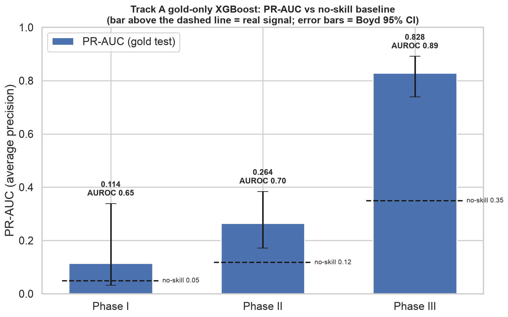

# CTO-Predict — Clinical Trial *Completion* Prediction

**A leakage-audited ML system that predicts whether a drug/biologic clinical trial will
reach completion — from registration-time metadata only, separately per phase (I / II / III),
using XGBoost.**

Binary target from ClinicalTrials.gov `overall_status`: **COMPLETED = 1**, **TERMINATED /
WITHDRAWN = 0**. No post-hoc data, ever — the model only sees what is knowable the day a trial
is registered.

---

## The hook: this predicts *completion*, not *efficacy*

Most published clinical-trial-outcome models — graph and foundation-model approaches such as
**HINT**, **SPOT**, and **AnyPredict** — predict **efficacy**: *will the drug work / win approval?*
CTO-Predict answers a different, less-studied question: **will the trial itself finish, or be
terminated / withdrawn?**

Those efficacy models report strong PR-AUC on their own benchmarks (roughly the 0.80–0.88 range),
but on a different *label*, cohort, and time split — so they are **not a fair comparison**. They
appear here only for context, never as a bar this project claims to clear. Every number below is
reported against its **no-skill baseline** (the positive rate), which is the honest yardstick for
an imbalanced problem.

## It works — Phase III especially



| Phase | PR-AUC | No-skill | AUROC | Evaluation |
|-------|--------|----------|-------|------------|
| **III** | **0.828** | 0.35 | 0.89 | single-split, 2024 hold-out |
| **II** | **0.264** | 0.12 | 0.70 | single-split, 2024 hold-out |
| **I** *(walk-forward)* | **0.308** | ≈0.18 | — | pooled 2021–2024 temporal CV |
| I *(single-split)* | 0.114 | 0.05 | 0.65 | 2024 hold-out — only 20 positives, unreliable |

Trained on trials completing **≤ 2022**, tested on **unseen 2024+ trials** — a true temporal
hold-out, never a random split. **Phase III sits well above its 0.35 no-skill baseline (AUROC 0.89)
and generalizes cleanly.**

A note on honesty, since it matters here: the figure above is the **single-split** result. Phase III
(0.828) and Phase II (0.264) are single-split and reliable. **Only Phase I is walk-forward** — its
single 2024 split has just 20 positives (PR-AUC 0.114, very wide CI), so the trustworthy Phase I
number is the **pooled walk-forward PR-AUC of 0.308** across four temporal folds, where it clears
each year's base rate.

## What makes this rigorous

- **Discovered the true target mid-project.** An audit of the labels revealed the task is
  *completion* (COMPLETED ≈ 91% success) vs *termination*, not efficacy — which reframes what any
  benchmark comparison means. Documented before a single production model was trained.
- **Proved the weak/gold gap is covariate shift, not label noise.** The weak-labeled set is ~83%
  positive and the expert-gold set ~20%; on the *same* trials the two labelings **agree 96–98%**.
  A decomposition attributes **94% of the gap to population shift and only ~3% to labels** — so the
  earlier model hadn't "learned labeling artifacts," it was trained and tested on different cohorts.
- **Found and removed 3 silent bugs and 2 soft data leaks** through systematic scanning: a mirror
  empty-overwrite guard, two dead (all-NaN) features from wrong magic-strings, and — caught by a
  SHAP leakage red-flag — facility/country counts that *accrue during trial conduct* and partly
  encode the outcome. The headline **survived** their removal (0.819 → 0.828 on the clean rebuild).
- **Killed a tempting data-augmentation path with evidence.** Adding ~117k weak-labeled trials
  ("Track B") was ruled out by two independent analyses (domain-classifier AUC ≥ 0.90) — an honest
  negative result, reported as one.
- **Triple-validated the headline:** leak-free (leakage gates + soft-leak removal), not overfit
  (train/val/test fit diagnostic), and at the **signal/data ceiling** (a tuning sweep and a
  label-expansion analysis both show more tuning/features won't move Phase II).

## Results depth

The full journey — audit, covariate-shift decomposition, the bake-off, the three-part Phase II
ceiling diagnosis, and the honest limits — is in **[reports/RESULTS.md](reports/RESULTS.md)**.

## How it's built

**Model.** Per-phase, fixed-config **XGBoost** (regularized, early-stopped on a temporal
validation split; class weights from gold base rates), Platt-calibrated on validation. Selection
is by a **promotion gate**, not by default: a **4-algorithm bake-off** (XGBoost / LightGBM /
CatBoost / CatBoost-native) on the identical 438-feature set found all four **statistically
indistinguishable** — no challenger cleared the gate (PR-AUC *and* AUROC co-primary, with Boyd
confidence intervals), so XGBoost was retained for simplicity.

**Features (438, schema 2.1.0).** 38 structured — 27 trial-design / sponsor-class / eligibility
features + 11 leakage-safe sponsor & therapeutic-area **historical-rate** features — plus 400
TF-IDF dimensions over eligibility-criteria text (38 + 400 = 438).

**Stack.** Python 3.11 · XGBoost / LightGBM / CatBoost · scikit-learn · SHAP · MLflow · DVC ·
pandas / PyArrow · pytest + ruff. Data sources: the **AACT** ClinicalTrials.gov mirror (591k
studies) and the **CTO** (Clinical Trial Outcome) gold/weak label sets.

```
src/cto/
  data/        AACT mirror + CTO label ingest
  features/    leakage gate · temporal split · feature build · sponsor/TA history
  models/      train · promotion gate · calibrate · SHAP · 4-way bake-off
  pipelines/   DVC stages: ingest → featurize → train
config/        features.yaml · leakage_blocklist.yaml
reports/       diagnostic reports + figures (the project's paper trail)
tests/         96 in CI + 9 local (need DVC data) — leakage, temporal, sponsor-history, gate
```

## Run it

```bash
uv sync
uv run pytest tests/                                 # 105 locally (96 in CI + 9 need DVC data), ruff-clean
dvc repro                                            # full pipeline (needs AACT creds — see .env.example)
uv run python scripts/visualize_model_results.py     # regenerate result figures from saved models
```

Data and trained models are DVC-tracked (not committed to git); a full reproduction needs AACT
Postgres credentials and Hugging Face access for the CTO labels.

---

*Scope & limits (in brief; full version in RESULTS.md): predicts **completion, not efficacy**;
validated on a retrospective temporal hold-out, **not prospectively**; the expert-gold test set is
deliberately failure-enriched, so its positive rate is not a natural base rate.*
