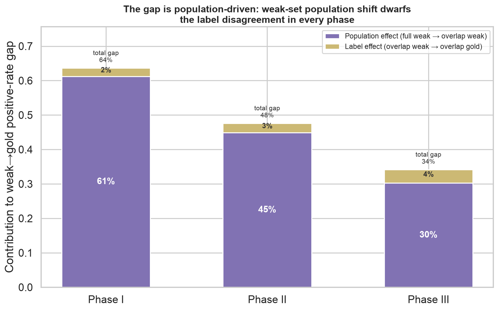
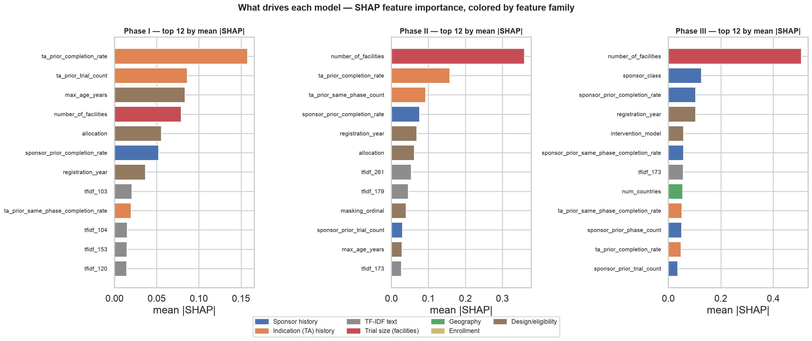
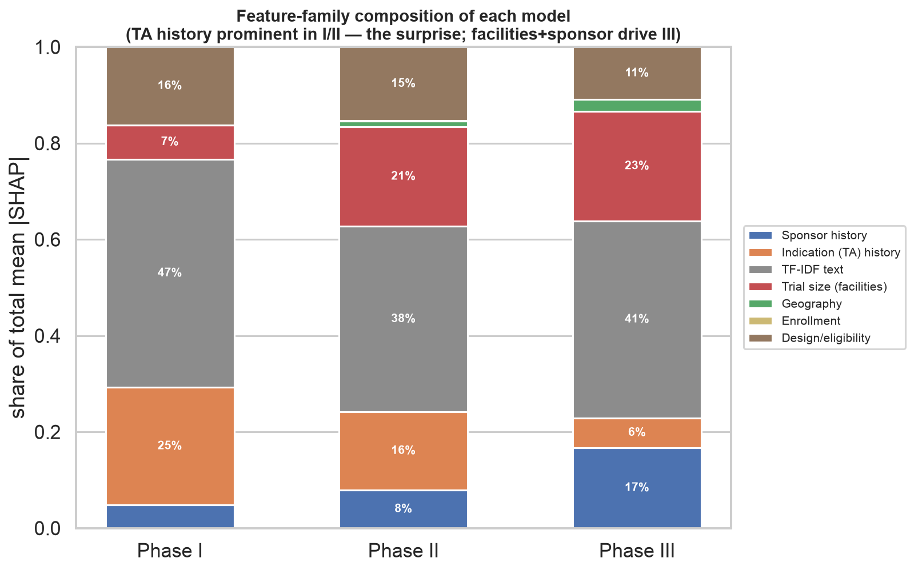
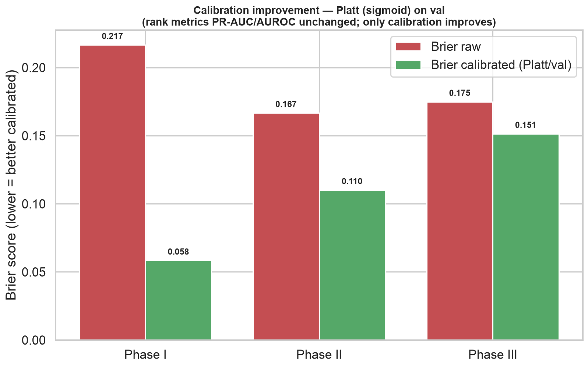
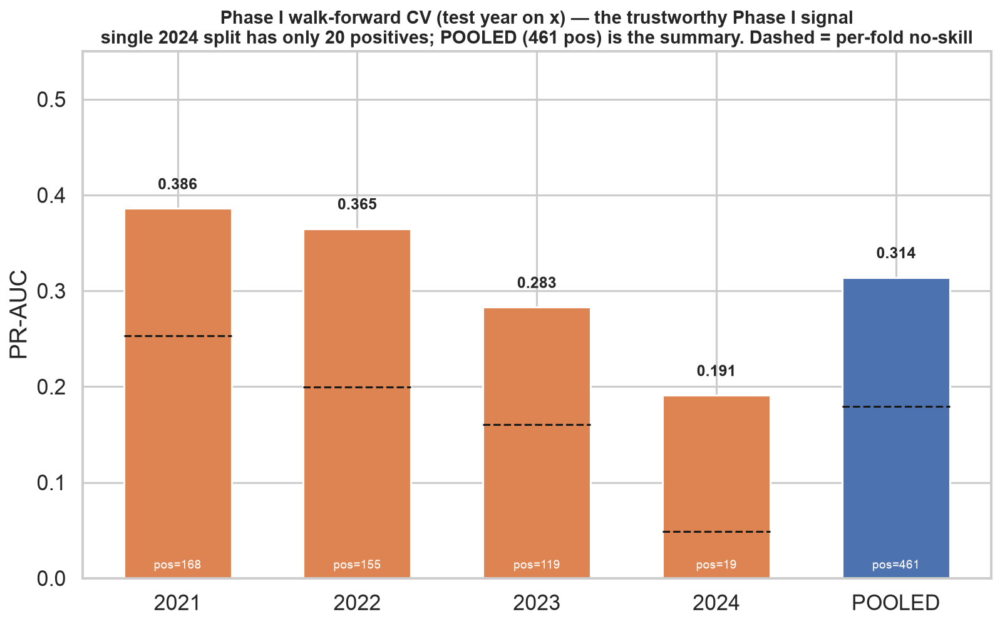
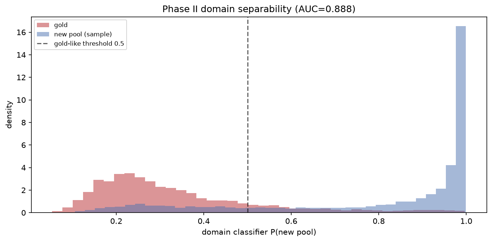
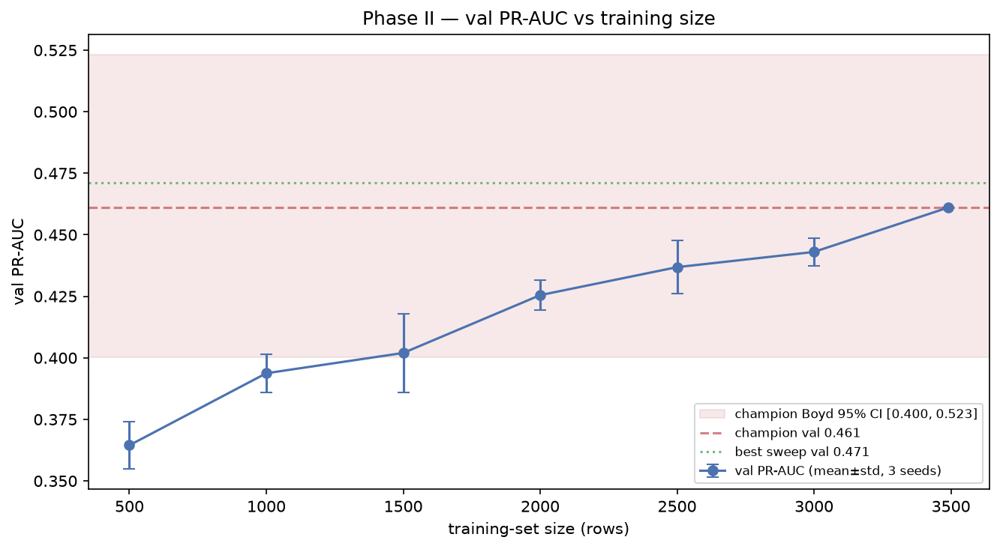

# CTO-Predict — Results & Methodology

This is the depth companion to the [README](../README.md). It walks the project as it actually
unfolded: the question, the twist that reframed it, the data finding underneath the whole thing,
the engineering discipline that made the results trustworthy, the model and its honest scorecard,
the forensic diagnosis of *why* the hard phases are hard, and the limits I will not paper over.

Every headline number here was reproduced from the saved 438-feature models on the frozen test
set during a ground-truth audit (`reports/project_audit.md`).

---

## 1. The question, and the twist

The goal is to predict a clinical trial's **outcome** from information available the day it is
registered — trial design, sponsor, eligibility criteria, therapeutic area — separately for Phase
I, II, and III. The intended use is triage: flagging, at registration time, trials at elevated risk
so sponsors and reviewers can look closer.

The twist arrived during a mandatory label audit, and it reframed the entire project. The target is
**not efficacy**. Labels are defined on ClinicalTrials.gov `overall_status`: a trial is a
"success" if it is **COMPLETED**, and a "failure" if it is **TERMINATED or WITHDRAWN**. The audit
made this unambiguous — among gold-labeled trials, **91.2%** of COMPLETED trials carry the positive
label while only **0.1%** of TERMINATED trials do. So the model predicts **whether a trial will
finish**, not whether the drug works.

That distinction governs how any benchmark should be read. The well-known trial-outcome models —
graph and foundation-model approaches such as HINT, SPOT, and AnyPredict — predict **efficacy /
approval**, on a different cohort and an older split, and report PR-AUC roughly in the 0.80–0.88
range on their benchmarks. They solve a harder, different problem. Citing them as a bar this project
"beats" or "loses to" would be a category error. The honest comparison is against the **no-skill
baseline** for each phase (the positive rate); for reference, published *tabular* baselines on this
completion-style task sit around 0.70 PR-AUC, which the Phase III model matches or exceeds.
Everything below is framed that way.

## 2. The data, and the finding underneath everything

Two label sources sit on top of the same **AACT** mirror of ClinicalTrials.gov (591k studies,
registration-time tables only):

- **CTO gold** — ~11k trials with expert human labels. This is the evaluation set, and *only* the
  evaluation set. It is never used for training or model selection.
- **CTO weak** — ~117k trials labeled by weak labeling functions (Phase I 41.5k, II 47.3k,
  III 28.3k). The Phase 1 baseline trained on these.

An obvious discrepancy demanded an explanation before any modeling: the weak set is ~83% positive,
but the gold set is ~20% positive in Phase I. Were the weak *labels* wrong, or were the two sets
different *populations* of trials? The two possibilities have opposite implications, so I measured
it rather than assuming.

The method holds population constant: on the overlap — the same trials, labeled both weakly and by
experts — the residual disagreement is the pure label effect. The result is decisive. The two
labelings **agree 96–98%** across phases, and on those shared trials the positive rates differ by
only 2–4 points. Walking the positive rate from the full weak set down to the gold rate and
splitting the movement into a *population* step and a *label* step gives **~45 points of population
effect and ~3 points of label effect — the population shift is 94% of the gap.**

The interpretation: the earlier model had not "learned labeling-function artifacts." It was trained
on a population that is ~83% completed and evaluated on one that is ~20% completed — a covariate /
prior shift, not label noise. (Confirming the labels are conservative rather than optimistic: the
weak-says-fail / gold-says-succeed cell is **exactly zero** in every phase — the weak function never
calls a real success a failure.) This finding is what justified training on gold labels only, and it
recurs as the root cause of the Phase II ceiling in §5.

## 3. The rigor spine — and what it caught

The project treats **leakage as the primary risk**, because on this task leakage is subtle and
seductive. The spine:

- **Test-driven throughout** — 96 tests run in CI (leakage, temporal integrity, sponsor-history
  correctness, the promotion gate), ruff-clean; 9 further integration tests validate the
  DVC-tracked feature matrices locally (the data is not committed to git).
- **A leakage gate on every feature build.** A blocklist of post-hoc columns is loaded once, and
  `assert_no_leakage()` runs at the end of every feature-construction function — a build that lets a
  blocklisted column through fails loudly rather than silently training on the future.
- **Temporal integrity, never random splits.** Data is split by `completion_date`; assertions
  enforce train < validation < test in time. The **frozen gold test set** (`gold_test_nct_ids.json`,
  phase I/II/III = 410/555/275) is computed once and treated as the single authoritative source —
  never recomputed elsewhere.

That discipline paid for itself by catching **three silent bugs** and **two soft data leaks**.

**Three silent bugs** (found by a dead-feature scan):
1. **Mirror empty-overwrite** — an incremental AACT pull returning zero rows could overwrite a
   populated snapshot with an empty file; now guarded.
2. **Dead `enrollment_log`** — gated on the wrong magic-string (`ANTICIPATED` instead of AACT's
   `ESTIMATED`), so it had been all-NaN since Phase 1. Fixed to use the registration-time ESTIMATED
   value only; ACTUAL enrollment is completion-time and is excluded as soft leakage. (It remains
   mostly-NaN by design — planned enrollment exists for only a small slice of completed trials — so
   it contributes little, which is honest rather than hidden.)
3. **Dead `accepts_healthy_volunteers`** — a `== "Yes"` string test against a boolean-typed column,
   so it was always 0. Fixed.

**Two soft data leaks — and I'll be candid about how one got in.** The initial model (schema 2.0.0,
441 features) included `number_of_facilities`, `num_countries`, and `is_multinational`. These were
built in good faith as trial-scale features — but `number_of_facilities` surfaced as the **#1 SHAP
feature** in Phase II and III, tripping the project's own "mean |SHAP| > 0.4 → investigate"
leakage red-flag. The investigation showed the problem: these counts are drawn from AACT tables that
**accrue during trial conduct** — sites and countries open over the trial's life. A WITHDRAWN trial
shows a truncated count (~1 site) precisely *because* it was withdrawn, so the feature partly encodes
the outcome. That is soft leakage, the same class as ACTUAL enrollment. **The country/geography
features were built, then caught, then removed** — blocklisted as conduct-accrued.

The honest part is what happened to the headline. An isolated diagnostic retrain dropping only
`number_of_facilities` suggested a ~0.04 dip (Phase III 0.819 → 0.779) — an intermediate number,
mentioned here only as the step it was. But the full **clean rebuild** (schema 2.1.0, 438 features),
in which the leakage-safe **sponsor and therapeutic-area historical-rate features** absorb the
signal that facilities had been standing in for, landed at **0.828** — slightly *above* the leaky
0.819. The leak was not load-bearing; removing it strengthened the result rather than costing it.

What drives the clean models is visible in the SHAP attributions, and it is domain-sensible:

TF-IDF eligibility text is the single largest family in every phase (51% / 60% / 41%). Indication
(therapeutic-area) history is a surprisingly strong contributor in Phase I (~31%), and **sponsor
track record grows with phase** to become the largest structured family in Phase III (~31%: sponsor
class, prior completion rate, industry-lead status). No facility or geography family appears — they
are gone.

## 4. The model, and its honest scorecard

The champion is a per-phase, **fixed-config XGBoost** — regularized (shallow depth, L2, high
min-child-weight), early-stopped on the temporal validation split, with class weights set from the
gold base rates rather than fitted to the training split. Probabilities are Platt-calibrated on
validation (small-n safe). There is **no Optuna, no stacking ensemble, and no AutoGluon/TabPFN** in
the result — a coarse 40-trial tuning sweep was run *only* as a ceiling diagnostic (see §5) and is
not part of the model.

XGBoost was not chosen by default; it was **retained by a promotion gate**. A four-algorithm
bake-off — XGBoost vs LightGBM vs CatBoost vs CatBoost-native — was run on the identical 438-feature
set, and every model was judged by the gate: PR-AUC **and** AUROC are co-primary, and a challenger
must clear a Boyd (2013) logit confidence interval (single-split for Phase II/III; walk-forward with
a Nadeau–Bengio corrected t-test for Phase I). **All four were statistically indistinguishable, and
no challenger cleared the gate on any phase** — Phase III was a literal tie (0.828 XGBoost vs 0.828
LightGBM), but LightGBM's CI lower bound fell below the champion's point estimate, so the gate
correctly refused to promote. Notably, CatBoost's native categorical handling gave *no* lift over
the engineered sponsor/TA features — evidence those features already capture the categorical signal.

The per-phase scorecard, reproduced from the saved models on the frozen test set:

| Phase | n (pos) | No-skill | PR-AUC [Boyd 95% CI] | AUROC | Brier (calibrated) | Evaluation |
|-------|---------|----------|----------------------|-------|--------------------|------------|
| **III** | 275 (96) | 0.35 | **0.828** [0.739–0.891] | 0.888 | 0.151 | single-split |
| **II** | 555 (65) | 0.12 | **0.264** [0.171–0.384] | 0.699 | 0.110 | single-split |
| I | 410 (20) | 0.05 | 0.114 [0.032–0.338] | 0.653 | 0.058 | single-split — 20 positives, unreliable |
| **I** | pooled 2573 (461) | ≈0.18 | **0.308** | — | — | walk-forward, 2021–2024 |

Phase II and III are single-split on the 2024 hold-out; **only Phase I is walk-forward** (the single
split is too positive-poor to trust). Calibration is genuine — Platt on validation improves the
Brier score while leaving the rank metrics (PR-AUC, AUROC) unchanged, as expected of a monotonic map:

## 5. Why the hard phases are hard — a three-part ceiling diagnosis

Phase III works. Phase I and II do not clear the bar one would want, and the interesting question is
*why* — is it a fixable modeling problem, or a genuine limit of the data? I approached it as three
independent tests, and they converge on the same answer.

**Part 1 — the augmentation that couldn't help (Track B, killed).** The obvious lever is more data:
add the ~117k weak-labeled trials to training. Two independent analyses rule it out. Importance
weighting toward the gold distribution collapses the effective sample size to ~5% (domain-classifier
AUC 0.90); and a failure-class shift diagnostic finds the weak *failures* are **more** shifted than
the population, not less — a domain AUC of **0.940** (above the whole-population 0.912), uniform
across phases, with only ~9% of weak failures reaching gold-like territory. The gold set was
expert-enriched for *hard, informative* failures; the weak failures are routine terminations. Adding
them would reintroduce exactly the covariate shift from §2. Ship gold-only — an honest negative
result.

**Part 2 — overfit, or signal-limited?** The fit diagnostic separates the two. Phase II shows a
train/validation/test PR-AUC of 0.86 / 0.46 / 0.26 — a real train–validation gap — but the
validation curve **plateaus from about round 20**, so more trees or depth do not help: this is a
*signal* limit, not a capacity limit. Phase III, by contrast, is healthy (0.90 / 0.71 / 0.83, a
train–test gap of only 0.07). The same story shows in the Phase I walk-forward, where the signal
visibly thins as the yearly positive count falls (168 → 155 → 119 → 19 from 2021 to 2024):

**Part 3 — would more labels help? (Label expansion, declined.)** If the ceiling is data, the fix is
*more gold labels* — so I scoped it. There are **53,411** new labelable Phase II trials available.
But a domain classifier separates gold from the new pool at **AUC 0.888** (strong shift), and even
within the covariate-overlap region (~10,600 trials) the completion rate is **0.80 versus gold's
0.28**. That gap is the crux: gold's low positive rate is a **curation artifact** — experts
deliberately enriched it for informative failures — not something observable from registration-time
features. Importance weighting corrects the feature distribution P(x), not this label-prior gap
P(y). The expected upside is low, so bulk expansion was declined and documented.

The learning curve seals it: Phase II validation PR-AUC is still rising monotonically at the full
3,490 training rows — the model is **label-limited, not signal- or feature-limited**. The lever is
*more curated labels*, not more tuning and not (yet) new features.

## 6. Honest conclusion, limits, and next steps

**Phase III completion prediction works** — PR-AUC 0.828 (well above the 0.35 no-skill baseline),
AUROC 0.89, clean generalization on an unseen future cohort, driven by domain-sensible
registration-time features.
**Phase I and II completion is genuinely hard from registration data**, and the diagnostics say so
for a defensible reason rather than a modeling failure. The AUROC ceiling observed here (0.89 / 0.70
/ 0.65 for III / II / I) is consistent with the ~0.70–0.80 range reported in the trial-outcome
literature.

The limits, stated plainly:

- **This predicts completion, not efficacy.** A completed trial is not a successful drug. The two
  should never be conflated, and efficacy benchmarks are not a comparison.
- **Not prospectively validated.** Evaluation is a retrospective temporal hold-out (train ≤ 2022,
  test 2024+). Real deployment value would require forward validation on trials registered *after*
  the model was built.
- **The gold test set is failure-enriched by curation.** Its positive rate is not a natural base
  rate, which is why every number is reported against an explicit no-skill line.
- **Phase I's single split is thin** (20 positives); its trustworthy signal is the walk-forward
  pooled estimate, and even that carries a wide interval.

**Next steps**, in priority order: (1) a serving layer (FastAPI over the saved per-phase models) to
make the triage use case real; (2) more curated gold labels — the identified lever for Phase II,
where the ceiling is data, not method; (3) prospective validation on a post-training registration
cohort.

The through-line: on this project, the most valuable outputs were not just the one strong number but
the **discipline that made every number honest** — finding the real target, decomposing the data
gap, catching the leaks, and reporting the negative results as clearly as the positive one.
